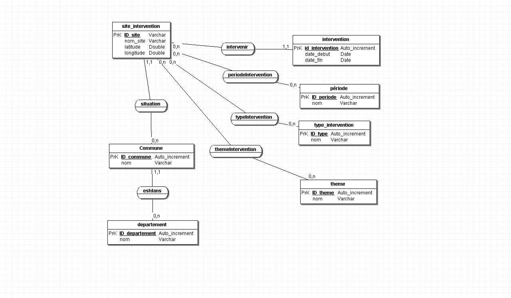

# archeologieBDD
Repository to study database and how to manage it.

## Merise, MCD et Server SQL
La base de données a été conceptualisée depuis Merise, transformée en script SQL Server et appliquée à une base de données SQL SERVER EXPRESS 2016.

